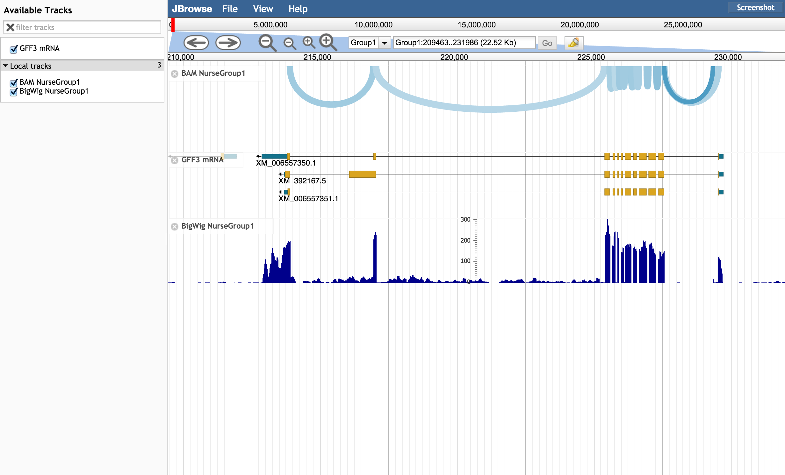

# sashimiplot

A JBrowse implementation of the sashimi plot style tool. Features a storeclass that converts RNA-seq BAM files into intron support coverage features, a track type that adds menu options, and a featureglyph that draws arcs.

## Track options

* style->color - color (RGB,HSL,hex) or callback function returning a color
* style->height - integer height or callback function returning height of the bezier curves.
* style->lineWidth - integer width or callback function returning width of the bezier curves.
* useXS - a built-in option to change color according to the XS tag (which indicates strand, inferred from canonical splice sites)
* readDepthFilter - a built-in option to filter out any junctions that have low coverage. Can also be adjusted from the menu options

Other options on the BAM store tracks can apply, such as chunkSizeLimit

## Example track config

The test/data directory contains an example config. There are several different setups

Calculate junctions straight from a BAM file with a config like this

      {
          "label": "Nurse_junctions",
          "storeClass": "JBrowse/Store/SeqFeature/BAM",
          "type": "SashimiPlot/View/Track/Sashimi",
          "urlTemplate": "Nurse.bam",
          "chunkSizeLimit": 50000000,
          "useXS": true
      }

Using a junctions.bed file loaded with flatfile-to-json.pl, example command `bin/flatfile-to-json.pl --bed junctions.bed --trackType SashimiPlot/View/Track/Sashimi --trackLabel sashimi_junctions`

      {
         "storeClass" : "JBrowse/Store/SeqFeature/NCList",
         "urlTemplate" : "tracks/test/{refseq}/trackData.json",
         "type" : "SashimiPlot/View/Track/Sashimi",
         "label" : "From_junctions_bed"
      }

Using a junctions.bed file with BEDTabix

      {
         "storeClass" : "JBrowse/Store/SeqFeature/BEDTabix",
         "urlTemplate" : "junctions.bed.gz",
         "type" : "SashimiPlot/View/Track/Sashimi",
         "label" : "From_junctions_bedtabix"
      }

Note: junctions.bed files include score and strand, so their behavior will be the same as if you were calculating this from the BAM file. The "Use XS" will simply apply to the bed file strand instead of the BAM file XS tag
